# Cart to Order Flow 📊

Dokumentasi diagram dan flow untuk integrasi Cart Service dengan Order Service dan Catalog Service.

## Architecture Overview


---

## Sequence Diagram: Add to Cart Flow


---

## Sequence Diagram: Complete Cart → Order Flow


---

## Data Flow Diagram


---

## Component Interaction Diagram


---

## State Diagram: Cart Item Lifecycle


---

## Data Transformation: Cart → Order

### Cart Service Output

```json
{
  "cart": {
    "items": [
      {
        "item_id": "uuid-1",
        "product_id": "P001",
        "name": "Laptop ASUS ROG",
        "price": 15000000,
        "quantity": 1,
        "subtotal": 15000000
      },
      {
        "item_id": "uuid-2",
        "product_id": "P002",
        "name": "Mouse Logitech G502",
        "price": 750000,
        "quantity": 2,
        "subtotal": 1500000
      }
    ],
    "total_items": 3,
    "total_price": 16500000
  }
}
```

### ⬇️ Transformation

Order Service transforms cart items ke order format:

### Order Service Input

```json
{
  "items": [
    {
      "product_id": "P001",
      "name": "Laptop ASUS ROG",
      "price": 15000000,
      "quantity": 1
    },
    {
      "product_id": "P002",
      "name": "Mouse Logitech G502",
      "price": 750000,
      "quantity": 2
    }
  ]
}
```

### Order Service Output

```json
{
  "order_id": "O001",
  "items": [...],
  "total_price": 16500000,
  "status": "WAITING_PAYMENT",
  "created_at": "2026-01-05T12:00:00.000Z",
  "updated_at": "2026-01-05T12:00:00.000Z"
}
```

---

## Integration Endpoints Summary

| Service | Endpoint | Method | Purpose |
|---------|----------|--------|---------|
| **Cart Service** | `/api/cart/add` | POST | Add item to cart |
| **Cart Service** | `/api/cart` | GET | Get cart data |
| **Cart Service** | `/api/cart/remove/:id` | DELETE | Remove item |
| **Cart Service** | `/api/cart/clear` | DELETE | Clear all items |
| **Catalog Service** | `/api/products/:id` | GET | Validate product |
| **Order Service** | `/api/orders` | POST | Create order from cart |
| **Order Service** | `/api/orders/:id` | GET | Get order details |

---

## Error Handling Flow


---

## Business Logic: Calculate Subtotal

```mermaid
flowchart LR
    Product[Product Data<br/>from Catalog] --> GetPrice[Get Price]
    Input[User Input] --> GetQty[Get Quantity]
    
    GetPrice --> Calc[Calculate Subtotal]
    GetQty --> Calc
    
    Calc --> Result[Subtotal = Price × Quantity]
    Result --> Store[Store in Cart Item]
    
    style Calc fill:#2196F3,color:#fff
    style Result fill:#4CAF50,color:#fff
```



**Formula:**
```
subtotal = price × quantity
total_price = Σ(subtotal for all items)
total_items = Σ(quantity for all items)
```

---

## Deployment Architecture


---

## Summary

### Key Points

1. **Cart Service** berjalan di port **3001**
2. **Validasi produk** dilakukan via **Catalog Service** (port 3002)
3. **Cart data** dapat diambil oleh **Order Service** (port 3000)
4. **Subtotal** auto-calculated untuk setiap item
5. **In-memory storage** untuk demo, mudah upgrade ke database
6. **Error handling** comprehensive untuk semua scenarios

### Integration Flow

```
User → Cart Service → Catalog Service (validate)
                    → Order Service (checkout)
                    → Clear Cart
```
